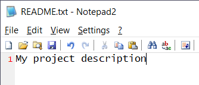
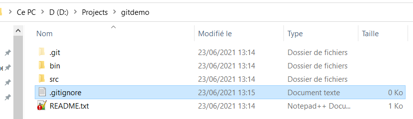
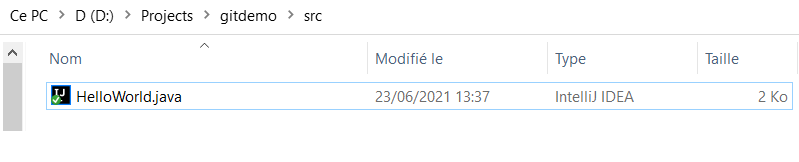

include::_settings_vars.adoc[]

== GIT demo and practice

In a first round, we will use the command line (say `cmd.exe` or  `bash`). Please note that the commands output is shown as comments. 

TIP: Commands whether they are issued from the command line or from a UI client have exactly the same effect. Those client tools are only passing parameters to the GIT commands or libraries. They effect the GIT repository in the same way and can be mixed interchangeably without problem. +
     + 
     A command done in a UI will be immediately seen in another as it is acting on the same repository.

=== Let's create a repository

Create a local folder and name it: `gitdemo`, then change to that directory. 

[source,bash]
----
mkdir gitdemo
cd gitdemo
git init
# hint: Using 'master' as the name for the initial branch. This default branch name
# hint: is subject to change. To configure the initial branch name to use in all
# hint: of your new repositories, which will suppress this warning, call:
# hint:
# hint:   git config --global init.defaultBranch <name>
# hint:
# hint: Names commonly chosen instead of 'master' are 'main', 'trunk' and
# hint: 'development'. The just-created branch can be renamed via this command:
# hint:
# hint:   git branch -m <name>
# Initialized empty Git repository in D:/Projects/gitdemo/.git/
----

=== Adding a first file

Edit a file with any text editor and name it : `Readme.txt`, put some content in it: *My project description*

.Adding a Readme.txt file

Add the file to the GIT object store and index (a.k.a. staging)

.Add the file to the index
[source,bash]
----
git add README.txt
# NO OUTPUT : the commands has completed successfully.
----

.Create some folders for the project
[source,bash]
----
mkdir bin
mkdir src
ls -l
# README.txt  bin         src
----

.Create a .gitignore file and add the content below:
[source, ini]
----
/bin
----

TIP: See how it looks with TortoiseGIT. The `Readme.txt` file has an overlay icon to denote it has changed status to added.
`bin` and `src` are not yet into the index hence they not show any overlay icon.

.Tortoise GIT overlay icon

Then add the file to the index:
[source, bash]
----
git add .gitignore
# NO OUTPUT
----

.Check if it was accepted footnote:[not mandatory, useful for the demo]
[source,bash]
----
git status
# gitdemo % git status
# On branch master
#
# No commits yet
#
# Changes to be committed:
#   (use "git rm --cached <file>..." to unstage)
#         new file:   .gitignore
#         new file:   README.txt
# no output : the commands has completed successfully.
----

.Commit staged changes to the repository

.on the current branch (i.e. the root branch by default)
[source, bash]
----
git commit -m "initial commit" # <1>
# or alternatively
git commit # <2>
gitdemo % git commit -m "initial commit"
# [master (root-commit) d8a2c83] initial commit
#  Committer: Munerot <munerotp@gmail.com>
# Your name and email address were configured # <3>
# automatically based on your username and hostname. Please check that they are accurate.
# You can suppress this message by setting them explicitly. Run the following command and follow the instructions in your editor to edit your configuration file:
#
#    git config --global --edit
#
#After doing this, you may fix the identity used for this commit with:
#
#    git commit --amend --reset-author
#
#  2 files changed, 1 insertion(+)
#   create mode 100644 .gitignore
#   create mode 100644 README.txt
----
<1> `-m` option is for setting the commit message directly from the command line.

<2> if no message is given, then a popup text editor or dialog will show up footnote:[depending on git tools installed and configurations]

<3> Git emits a warning as my repository is not configured with my user account yet.

=== Create more content

.Edit a new file `HelloWorld.java` in the `src` folder:
[source, java]
----
/******************************************************************************
 *  Compilation:  javac HelloWorld.java
 *  Execution:    java HelloWorld
 *
 *  Prints "Hello, World". By tradition, this is everyone's first program.
 *
 *  % java HelloWorld
 *  Hello, World
 *
 *  These 17 lines of text are comments. They are not part of the program;
 *  they serve to remind us about its properties. The first two lines tell
 *  us what to type to compile and test the program. The next line describes
 *  the purpose of the program. The next few lines give a sample execution
 *  of the program and the resulting output. We will always include such 
 *  lines in our programs and encourage you to do the same.
 *
 ******************************************************************************/

// https://introcs.cs.princeton.edu/java/11hello/HelloWorld.java.html

public class HelloWorld {

    public static void main(String[] args) {
        // Prints "Hello, World" to the terminal window.
        System.out.println("Hello, World");
    }

}
----

[source, bash]
----
git status
# On branch master
# Untracked files:
#  (use "git add <file>..." to include in what will be committed)
#         src/---- # <1>
----
<1> Git has detected untracked changes that could be added to the index. +
        +
Note the it did not include `bin` as instructed in the `.gitignore` file.

[source,bash]
----
git add -A # <1> 
git status # <2>
# On branch master
# Changes to be committed:
#  (use "git restore --staged <file>..." to unstage)
#        new file:   src/HelloWorld.java
----
<1> This will add all non ignored files and folders found in the current folders and subfolders

<2> This will show what git considers as `staged` or `ignored` or `unstaged`.

.Commit the new changeset
[source, bash]
----
git commit -m "added  helloworld program"
# [master d44652a] added  helloworld program  # <1>
#  Committer: Munerot <munerotp@gmail.com>
#  ... 
# 1 file changed, 28 insertions(+) # <2> 
# create mode 100644 src/HelloWorld.java
----
<1> master branch and commit id  

<2> list and count line modifications for the file

.Tortoise GIT view of the new file

.Review the history

[source,bash]
----
git log
# commit d44652a301cf9d2a12a6327fb1fac37d09088310 (HEAD -> master)
# Author: Munerot <pascal.munerot@gmail.com>
# Date:   Wed Jun 23 13:44:11 2021 +0200
#
#     added  helloworld program
#
# commit d8a2c832a176d2ffb06df1a1bbcbaebf029abf8b
# Author: Munerot <pascal.munerot@gmail.com>
# Date:   Wed Jun 23 13:23:29 2021 +0200
#
#     initial commit
----

TIP: So far, the manipulations have been performed locally (folder based repository and working copy).

