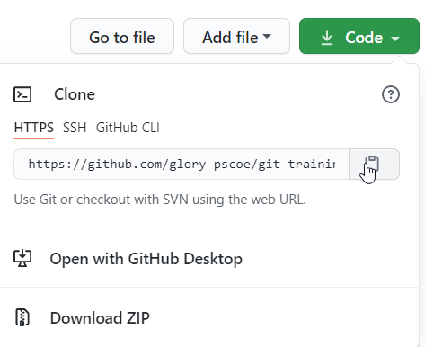
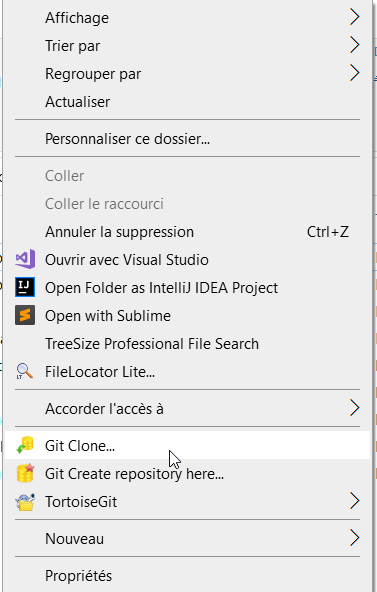
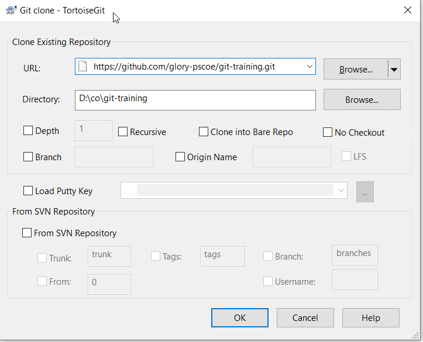
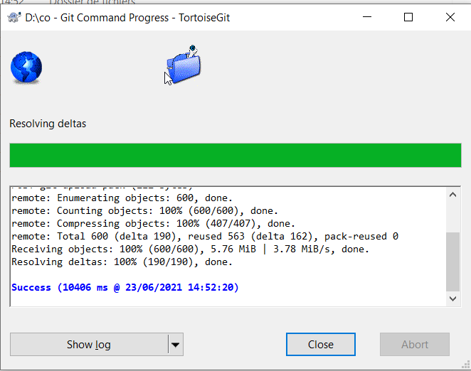

include::_settings_vars.adoc[]

== Github introduction

=== Owner

Bought by Microsoft a few years ago. It is the most successful Git provider ... but not only.

Competion include: gitlab, bitbucket, gitea ... plenty others. Offers are plan-based pricing and hosted in the cloud by default.

Some of them provide the possibility to host their software inhouse. 

=== Added features

* Issue tracking : Github has issue tracking

* Pull requests : A pull request is a way to ask a repository owner/member to review a change that another member of external person (with public repositories) to review the changes and accept it into the `origin` repository.

* Project management 

* WIKI features

* Automated build & releases

* Automatic security review (dependabot)

A typical use case consists of using Github (or any other similar provider) as a remote repository (with respect to the local or `master` repository).

* Project web site content (https://github.io) 

* Enterprise level features

== Cloning an already existing repository

A repository can be accessed through its URL (or more correctly URI).

.Finding the repository URL in Github

The URL for the GIT repository is https://github.com/glory-pscoe/git-training.git[]

.Let's try first from the command line

[source, bash]
----
git clone https://github.com/glory-pscoe/git-training.git
# munerotp@LFRCRA02447  /d/co % git clone https://github.com/glory-pscoe/git-training.git
# Cloning into 'git-training'...
# remote: Enumerating objects: 600, done.
# remote: Counting objects: 100% (600/600), done.
# remote: Compressing objects: 100% (407/407), done.
# remote: Total 600 (delta 190), reused 563 (delta 162), pack-reused 0R
# Receiving objects: 100% (600/600), 5.76 MiB | 980.00 KiB/s, done.
# Resolving deltas: 100% (190/190), done.
#
# or through the github cli command
gh repo clone glory-pscoe/git-training
# not shown here => TODO later
----

.Let try now with TortoiseGIT

First copy the repository URL into the clipboard. Then, use the contextual menu and select `Git Clone..`:

Then the GIT clone dialog will show up:

Click OK:

== Create a new repository and import content

WARNING: TODO
